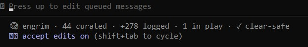

# engrim

[](https://github.com/timgordontg/engrim/actions/workflows/ci.yml)
[](https://www.python.org/)
[](LICENSE)
[](#security--privacy)

**Cross-session memory for Claude Code.** A small local store that remembers your project's
decisions and facts, tags them by repo, and hands your agent just the relevant slice — at the start
of each session and on every prompt — so you can `/clear` aggressively without losing the *why*
behind your work.



<sub>engrim, ambient in the Claude Code status bar — it even tells you when it's `✓ clear-safe` to clear.</sub>

> **Clearing your agent's context without engrim feels like closing a doc without hitting save.**
> We've all got the high-school muscle memory of losing an unsaved assignment — so we *don't* clear,
> we just keep hammering one bloated session. **engrim is the save button.** Externalize your
> decisions as you go, then clear freely and watch them reload intact.

The problem, concretely: an agent's context window is expensive and forgetful. Everything it knows
about your project either sits in the window (costly, and re-billed every turn) or vanishes when you
clear. The first thing lost is the rationale that was never written into your code or files. engrim
keeps that on disk and returns a precise, *meaning-ranked* slice on demand — so your memory grows
unbounded while the context you actually load stays small.

It's the **supercharger to your agent's engine**, not a replacement for it. Claude Code's native
context handling is excellent; engrim doesn't compete with it — it complements it, and charges it:
the engine stays lean and fast, engrim holds the deep, queryable, cross-session layer you pull from
on demand.

```bash
pip install git+https://github.com/timgordontg/engrim
engrim setup
```

That's the whole install. `setup` wires engrim into Claude Code and warms the semantic model once.
Next session, your agent starts already knowing your project — **and it understands what you *mean***,
not just keywords you typed. A prompt about *"the database"* surfaces the decision that said
*"Postgres."*

## Who it's for

engrim is built for **heavy, long-horizon work** — the multi-week build where the *why* spans dozens
of sessions and lives in nobody's head by Friday. Trading systems, data pipelines, gnarly
migrations, anything you'll `/clear` and resume across days. If that's you, this is the tool that
would've saved you three months ago.

If you do short, one-off sessions, you probably don't need it — and that's fine. engrim earns its
keep precisely when a project is too big to hold in one window.

**It compounds.** The longer and deeper your Claude sessions run, the more decisions and rationale
engrim has captured — and the more valuable each reload becomes. A fresh project barely needs it; a
project you've been hammering for weeks has a memory layer no single context window could ever hold,
handed back to you a relevant slice at a time. Value grows with the depth of the work, exactly when a
plain context window is hitting its limits.

## Try the save button (60 seconds)

Don't take it on faith — prove it to yourself:

```bash
engrim add -t decision -s "Chose Postgres over Mongo for relational integrity" --tags db
# ...now /clear your Claude Code session (or close it and open a new one)...
engrim context        # there's your decision, already reloaded and oriented
```

The first time you clear and watch your context come back, the fear is gone for good.

## See it working — the live status line

`engrim setup` adds an ambient line to Claude Code's status bar, so you can *watch* the memory layer
work without it ever cluttering the chat:

```
🧠 engrim · 32 curated · +14 logged · ✎ 2 to capture
```

- **`32 curated`** — high-signal records in this project's memory (grows when you `add`).
- **`+14 logged`** — turns recorded to the transcript log *this session*. This **ticks up every turn**:
  even when you're not adding curated records, engrim is capturing the raw back-and-forth for free (zero
  tokens, never loaded into context). It's the live proof that nothing is silently dropping on the floor.
- **`✎ 2 to capture` / `✓ clear-safe`** — recent decisions that don't yet appear in curated memory. Your
  at-a-glance **"is it safe to `/clear`?"** answer: capture what's flagged, watch it flip to `✓`, then
  clear freely. The pencil is an invitation, not a warning — capturing as you work is normal. (Same honest
  signal as `engrim review`, kept light enough to live in the status bar.)

The number that *moves* is the log; the number that *matters long-term* is curated. Seeing both is how
you learn the rhythm: work, capture the decisions, clear, reload.

## Smart, hot context loading

engrim is **retrieval-first by design**, not a notes file that grew a search box. The bet — straight
out of ML research — is that *learned, query-conditioned selection of what to load* beats stuffing
everything into the window and hoping the model sorts it out.

Retrieval is **hybrid**: every record is embedded when written, and recall fuses keyword relevance
(SQLite FTS5 / bm25) with semantic similarity (embedding cosine) via reciprocal-rank fusion.

- **Keyword** nails exact IDs, symbols, error strings, file names.
- **Semantic** catches paraphrase and concept — *"how should I reach customers"* finds the record
  about *outreach*, with zero shared words.
- **Fused**, they beat either alone.

Semantic is **on out of the box** — the embedding model (a fast *static* embedder, `model2vec`, no
GPU and no per-prompt neural pass) ships as a dependency and `engrim setup` warms it for you. Want a
zero-third-party-dependency, fully-offline posture instead? Set `ENGRIM_EMBED=off` and engrim runs
pure-lexical on the standard library alone.

## Clear often — keep the context that matters

Because engrim persists your project's decisions and reloads them at session start, you can `/clear`
or `/compact` aggressively to keep your agent fast and lean — *without* losing the context you care
about:

1. **Capture as you go** — `engrim add ...` the moment a decision or fact lands (your agent can do
   this for you).
2. **Clear freely** — when the session gets heavy, `/clear`. The bloat goes; the knowledge stays.
3. **Reload lean** — the SessionStart hook injects your project's memory pack, so the next session
   starts oriented in a few hundred tokens instead of dragging a giant window.

Externalize → clear → reload. A small, durable store beats a giant, expensive context window — and
it's lighter on rate limits, latency, *and* output quality (a clean, relevant slice gets sharper
attention than 100k tokens of accumulated cruft).

> **Not sure it's safe to clear?** `engrim review` scans your recent transcript for decisions that
> aren't in curated memory yet and flags them — so you capture them *before* you clear, not after you
> realize they're gone. It's deliberately honest: it nudges you when unsure rather than falsely
> reassuring you, and only says *"looks safe to clear"* when nothing's outstanding.

## "Isn't this just markdown notes / CLAUDE.md?"

No — and the difference is the whole point. Markdown memory is great until it outgrows the context
window, and then it forces a bad trade: **bloat the window, or truncate the file.** (Claude Code
literally warns you when a memory file gets too big.) engrim removes the choice — your memory grows
unbounded while the context you load stays small and relevant.

| | Markdown files | engrim |
|---|---|---|
| **Loading** | the whole file (or truncated) | a budget-capped *relevant slice* |
| **Retrieval** | "load it all and hope" | hybrid keyword + semantic ranking, on demand |
| **Scale** | context cost grows until it hits a wall | stays bounded as memory grows 100× |
| **Structure** | unstructured prose | types, tags, status, recency |
| **Lifecycle** | rots; you hand-prune | `supersede` stale records, keep history honest |
| **Multi-project** | per-folder, manual | one store, auto-scoped by project path |
| **Programmatic** | hand-edit | a queryable DB any tool or hook reads & writes |

It's **not anti-markdown and not a replacement** for your agent's md memory. Think *engine and
supercharger*: your `CLAUDE.md` is the engine — the hot working set your agent loads natively every
session. engrim is the supercharger bolted alongside — the deep, queryable archive you pull from on
demand so the window stays small. Clean division of labor: **md = hot working set, db = deep
archive.** The seed-once context build below establishes that division without you babysitting it.

### Day-1 context build, then db-canonical (seed-once)

The first time engrim runs for a project it does a **one-time context build**: it mirrors your
existing markdown memory (e.g. Claude Code's per-project memory dir) into the store, so day one
already carries your pre-install history. **After that it steps aside** — the store is canonical,
sessions read from it, and new knowledge is logged via `engrim add`. It will *not* keep re-importing
historical md over your live store (that would let stale history overwrite real work). Re-pull md
deliberately any time with `engrim sync --claude --force`.

```bash
engrim sync ./docs            # build the store from a markdown dir (idempotent; re-runs are safe)
engrim sync --claude          # seed-once from Claude Code's memory dir for this project
engrim sync --claude --force  # deliberately rebuild from md (the only way to re-import)
```

## Two tiers: curated memory + the full-conversation log

engrim keeps two separate stores so they never compete:

1. **Curated memory** (`memories`) — the decisions/facts/feedback you (or your agent) record. Small,
   high-signal, and the *only* tier loaded into the boot pack. This is what keeps context lean.
2. **Transcript log** (`log`) — an append-only record of the raw back-and-forth, **never injected
   into context.** A flight recorder: complete, replayable, queried only on demand.

With `engrim setup`, a `Stop` hook tails Claude Code's own transcript JSONL into SQLite after each
turn — reading only the new bytes (a per-session byte-offset cursor) and de-duping on each turn's
stable `uuid`, so it's cheap and idempotent. Writing to the log costs **zero tokens and zero
context** (it's a disk append), so you can `/clear` every single turn and lose nothing. Browse or
search it with `engrim logs [-q "..."]`.

> **engrim does not enlarge Claude's context window** — nothing can. It lets you *use* the window
> efficiently: load a lean slice, keep the rest on disk, pull more only when you ask. That's the
> trade that keeps a big chat gentle on session and rate limits instead of re-billing a giant window
> every turn.

## A global layer that follows you everywhere

Most memory is project-specific — *this repo chose Postgres.* But some truths are about **you**, not
any one repo: who authors your code, how you like commits written, conventions you hold across every
project. engrim keeps a single **global user-layer** for exactly those and **co-loads it alongside
whatever project you're in** — so you state them once and they ride into every session, everywhere.

```bash
engrim add --global -t user -s "Sole author — never add Co-Authored-By trailers"
```

It's purely additive: the global layer rides *alongside* project memory — the boot pack, the minder,
and `recall` all span both — never instead of it, and one project's own records never leak into
another. Budget discipline is unchanged: the global layer flows through the same fair, capped boot
pack, so it can't bloat your context. This is **vertical layering** (*user ⊕ project*), deliberately
*not* arbitrary multi-project loading — that would dilute the lean slice that's the whole point. Don't
want it? `ENGRIM_NO_GLOBAL=1` turns it off and reads go back to project-only.

## How it works

- **Store:** one SQLite file with an FTS5 virtual table kept in sync by triggers, plus an embedding
  table for the semantic tier. WAL mode for safe concurrency.
- **Hybrid recall:** bm25 lexical rank fused with embedding cosine (reciprocal-rank fusion).
  Embeddings are computed once at write time (`add` auto-embeds) and stored; per prompt the minder
  embeds only the short query and does cosine — no per-turn neural pass.
- **The four-hook loop** (`engrim setup` wires it, idempotently):
  - **SessionStart → `engrim hook`:** on a project's first run, seed-once from file-memory; then
    inject the budget-capped boot pack (you see exactly what was restored). It also reconciles recent
    transcripts, so a session that **crashed or hard-closed** (skipping Stop/SessionEnd) gets its
    dropped tail swept up on the next boot — idempotent.
  - **UserPromptSubmit → `engrim assist`:** the minder. Ranks the store against your prompt and
    injects only the top few records (gated on ≥2 substantive terms; ~150-token cap; hits-only).
  - **Stop → `engrim log --hook`:** tails the transcript JSONL into the append-only `log` table —
    new bytes only, de-duped by `uuid`. Never enters context.
  - **SessionEnd → `engrim sync --claude`:** a final, seed-gated mirror (no-op once seeded).
- **Boot-pack priority:** `user` → `feedback` → `state` → `decision` → `fact` → `reference`,
  recent-first within each type, capped to a character budget so it loads cheaply.
- **Perf:** each hook is a short-lived process, off the critical path except UserPromptSubmit, where
  it's invisible against model latency. A project with nothing embedded never pays the model-load
  cost.

## Configuration

Everything is controllable by flag or environment variable — nothing is hard-coded.

| Env var | Default | Purpose |
|---|---|---|
| `ENGRIM_DB` | `~/.engrim/memory.db` | Path to the SQLite store. Point many machines/containers at one shared file. |
| `ENGRIM_PROJECT` | *(unset)* | A **stable project tag**. Set it so the same project resolves identically across host and containers. |
| `ENGRIM_EMBED` | *(on)* | Semantic recall. On by default; set to `off` for pure-lexical, zero-third-party-dependency mode. |
| `ENGRIM_EMBED_MODEL` | `minishlab/potion-base-8M` | The embedding model (any model2vec static model). |
| `ENGRIM_NO_GLOBAL` | *(unset)* | Set to disable the global user-layer co-load, so reads are project-only. |

**Project-tag precedence:** `--project` flag → `$ENGRIM_PROJECT` → **git root of cwd** → cwd.

- *git root* means you can launch from any subdirectory of a repo and get the same memory.
- *`$ENGRIM_PROJECT`* gives a stable tag when paths differ (a host's `/home/you/app` vs a container's `/app`).

## Docker — works *with* and *without* it

engrim needs no Docker. But if you live in containers, you can give every container **and** the host
one shared brain in two steps:

1. **Share the store** — mount one host directory into each container and point `ENGRIM_DB` at it.
2. **Stabilize the tag** — set `ENGRIM_PROJECT` so a project resolves the same name everywhere.

```yaml
# examples/docker-compose.yml
services:
  app:
    image: your-app
    environment:
      ENGRIM_DB: /memory/memory.db      # shared store inside the container
      ENGRIM_PROJECT: my-app            # stable tag across host + every container
    volumes:
      - ~/.engrim:/memory               # one host dir, shared by all containers
```

SQLite runs in WAL mode (concurrent readers, serialized writers) — ideal for a shared **local**
volume. (Avoid a single store over a network filesystem like NFS.)

## Commands

| command | what it does |
|---|---|
| `engrim setup` | wire the four-hook loop into Claude Code + warm the semantic model (one-time, idempotent) |
| `engrim add` | write a memory: `-t TYPE -s "summary" [-d detail] [--tags a,b]` (auto-embeds); `--global` writes the user-layer that loads in every project |
| `engrim recall -q "..."` | hybrid keyword + semantic recall for the current project |
| `engrim assist` | **the minder** — UserPromptSubmit hook: auto-inject the relevant slice for a prompt |
| `engrim context` | priority-ordered, budget-capped session-boot pack |
| `engrim review` | **"safe to clear" coverage check** — flags recent decisions in the log not yet in curated memory |
| `engrim sync [DIR\|--claude]` | seed-once md→store mirror (upsert + reconcile); `--force` to rebuild |
| `engrim import <path>` | bulk-import markdown notes as records (insert-only) |
| `engrim embed` | backfill embeddings (rarely needed — `add` auto-embeds; use after a model change) |
| `engrim logs [-q "..."]` | browse/search the transcript log (kept out of the boot pack) |
| `engrim supersede --id N` | mark a record `superseded`/`done` |
| `engrim list` · `projects` · `stats` | browse and summarize (stats reports context economics) |

Record types: `decision`, `fact`, `feedback`, `state`, `user`, `reference`. Stale records are
`supersede`d rather than deleted, so history stays honest.

## Security & privacy

engrim is built to be safe to run without a second thought. Full posture in [SECURITY.md](SECURITY.md).

- **No telemetry, never phones home.** engrim itself opens no sockets. The *one* exception is a
  one-time download of the embedding model from HuggingFace on first run (cached forever after, then
  fully offline). Run `ENGRIM_EMBED=off` for a no-network, pure-standard-library posture.
- **Minimal dependencies.** The core is pure standard library; the semantic tier adds `model2vec`
  and its well-known ML deps (numpy, safetensors, tokenizers, huggingface-hub). Lexical mode pulls
  none of them.
- **No dangerous primitives.** No `eval`/`exec`/`pickle`/`subprocess`/shell, and no `yaml.load`
  (frontmatter is parsed by hand) — the classic RCE vectors are designed out.
- **No SQL-injection surface.** Every input is bound via `?`; search terms are tokenized/quoted
  before reaching SQLite, so code symbols and punctuation can't inject query operators.
- **Private on disk.** The store is created owner-only (`0600`) on POSIX.
- **Your data never ships to git.** `*.db` is gitignored; you commit the tool, never your memory.

## Testing

A real test suite covers persistence, hybrid + semantic recall, supersession, the boot pack, the
hook JSON contract, git-root tagging, and the env overrides. CI runs it across Python 3.10–3.13.

```bash
pip install pytest
pytest -q
```

## Limitations & edge cases (the honest list)

engrim is small and opinionated on purpose. Known edges, stated plainly:

- **It remembers what gets *recorded*, not everything you say.** This is the most important one.
  Curated memory holds what you (or the agent) `add`; the boot pack and the minder only surface
  *that*. If a decision is discussed but never recorded before the session closes, it isn't in
  curated memory — capture matters. (The transcript `log` keeps the raw back-and-forth, but it's a
  flight recorder you query deliberately, not what the minder reasons over.)
- **Retrieval, not comprehension.** The minder ranks records by relevance to your prompt — fast and
  good, but it doesn't *understand* them. Hybrid ranking can still over-weight a stray keyword match
  on very abstract queries; rerank and adaptive fusion are on the [roadmap](ROADMAP.md).
- **First-run model download.** The semantic tier fetches a small model from HuggingFace once
  (`engrim setup` does this up front with a visible message). Offline/locked host? `ENGRIM_EMBED=off`
  runs lexical with no network.
- **It doesn't enlarge the context window.** Nothing can. It lets you *use* the window efficiently.
- **Monorepos:** git-root tagging treats the whole repo as one project. For per-package memory, set
  `ENGRIM_PROJECT` per package.
- **Docker on macOS/Windows:** SQLite over a Docker Desktop **bind mount** can hit filesystem-locking
  flakiness. Use a **named volume** there; native Linux bind mounts are fine.
- **Single-user by design.** No auth or multi-tenant model — it's your local memory, not a team server.
- **Moved a project folder?** Memory stays under the old path tag. Re-tag by exporting/re-adding, or
  pin a stable `ENGRIM_PROJECT`.

## Agent support

engrim's core is **agent-agnostic** — a CLI over a SQLite file, so anything that can run a shell
command can use it. The *auto-load* integration (hooks that inject memory automatically) is
**Claude Code-first** in these early releases; the brain is universal, only that adapter is
per-agent. Broader provider support is on the [roadmap](ROADMAP.md). **Open SQLite, no lock-in.**

## Why it's free

engrim is MIT-licensed and free because the people doing the hardest builds shouldn't have to lose
their context to do them. If it saves you a fraction of what it would've saved me, that's the point.
Ideas and pull requests welcome.

## License

MIT © 2026 Tim Gordon. Not affiliated with Anthropic.
