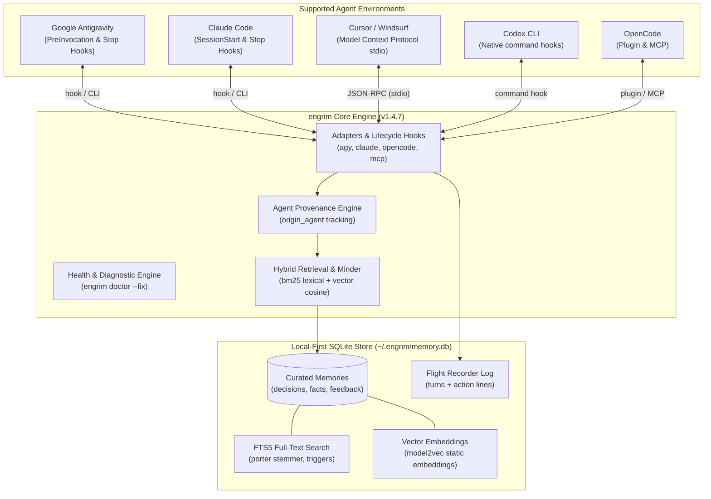

# engrim

[](https://github.com/timgordontg/engrim/actions/workflows/ci.yml)
[](https://pypi.org/project/engrim/)
[](https://engrim.dev)
[](https://www.python.org/)
[](LICENSE)
[](#security-privacy)
[](https://glama.ai/mcp/servers/timgordontg/engrim)

**The Universal Cross-Model & Cross-Agent Episodic Memory Standard.**

A local-first, project-scoped SQLite memory engine that allows developers to freely switch between models and environments (**Google Antigravity**, **Claude Code**, **Cursor**, **Codex CLI**, **OpenCode**, and **Windsurf**) on the **same codebase** without losing architectural decisions, user constraints, or project state.

---

## 1. Overview & Core Value Proposition

> **"Why pay for 200,000 tokens of forgotten noise on every turn? The models are disposable utilities; your project's decisions are not."**

**Engrim** is the universal, cross-model episodic memory standard engineered specifically for autonomous AI coding agents and heavy software development.

It solves the **"200,000-token context window trap"** (where coding models suffer from severe attention dilution, compounding per-turn token costs, and the loss of prior architectural decisions whenever a chat session is cleared) by replacing raw transcript replay with **4,000 characters of high-precision, curated episodic working memory** stored in a single, local-first SQLite file (`~/.engrim/memory.db`).

### The Problem vs. The Engrim Standard

| Challenge | Without Engrim (Token Bloat & Context Resets) | With Engrim (Episodic Continuity) |
|:---|:---|:---|
| **Context Window** | **Attention Dilution**: 150k+ tokens re-sent on every turn; models lose reasoning sharpness and hallucinate past constraints. | **Precision Working Memory**: ~4,000 chars (<1,000 tokens, <1% of context) injected at boot. Zero attention dilution. |
| **Session Clearing** | **Context Reset on `/clear`**: Clearing chat wipes agent context to zero; you spend minutes re-explaining rules and architecture. | **Continue-As-Clear**: Clear anytime (`/clear`). Decisions, active state, and `[▶ RESUME HERE]` reload instantly. |
| **Agent Ecosystem** | **Vendor Silos**: Decisions made in Claude Code are invisible in Antigravity, Cursor, Codex, or OpenCode. | **Universal Substrate**: One local SQLite store (`~/.engrim/memory.db`) shared across all 5 major harnesses. |
| **Hook Reliability** | **Silent Failures**: Moving across machines or OSes silently breaks hardcoded binary paths with no error message. | **Self-Healing Diagnostics**: `engrim doctor --fix` verifies all hooks and installs portable PATH fallbacks. |
| **Data Privacy** | **SaaS Cloud Leakage**: Proprietary code and architectural constraints sent to third-party memory APIs. | **100% Local & Private**: Stored locally in SQLite WAL mode (POSIX `0600`). No telemetry, no cloud sync, no tracking. |

---

## 2. Architecture & How It Works (The 10-Second Mental Model)


```mermaid
graph TD
    subgraph Agents ["Supported Agent Environments"]
        AGY["Google Antigravity<br/>(PreInvocation & Stop Hooks)"]
        CLAUDE["Claude Code<br/>(SessionStart & Stop Hooks)"]
        CURSOR["Cursor / Windsurf<br/>(Model Context Protocol stdio)"]
        CODEX["Codex CLI<br/>(Native command hooks)"]
        OPENCODE["OpenCode<br/>(Plugin & MCP)"]
    end

    subgraph CoreEngine ["engrim Core Engine (v1.4.7)"]
        ADAPTERS["Adapters & Lifecycle Hooks<br/>(agy, claude, opencode, mcp)"]
        DOCTOR["Health & Diagnostic Engine<br/>(engrim doctor --fix)"]
        PROVENANCE["Agent Provenance Engine<br/>(origin_agent tracking)"]
        ROUTER["Hybrid Retrieval & Minder<br/>(bm25 lexical + vector cosine)"]
    end

    subgraph Storage ["Local-First SQLite Store (~/.engrim/memory.db)"]
        MEMORIES[("Curated Memories<br/>(decisions, facts, feedback)")]
        FTS5["FTS5 Full-Text Search<br/>(porter stemmer, triggers)"]
        VEC["Vector Embeddings<br/>(model2vec static embeddings)"]
        LOG["Flight Recorder Log<br/>(turns + action lines)"]
    end

    AGY <-->|"hook / CLI"| ADAPTERS
    CLAUDE <-->|"hook / CLI"| ADAPTERS
    CURSOR <-->|"JSON-RPC (stdio)"| ADAPTERS
    CODEX <-->|"command hook"| ADAPTERS
    OPENCODE <-->|"plugin / MCP"| ADAPTERS
    ADAPTERS --> PROVENANCE
    PROVENANCE --> ROUTER
    ROUTER --> MEMORIES
    MEMORIES --- FTS5
    MEMORIES --- VEC
    ADAPTERS --> LOG
```

1. **Boot**: When your agent starts or a prompt is submitted, `engrim` injects the top-priority memory pack (~4k chars) into the agent's context, leading with `[▶ RESUME HERE]`.
2. **Capture**: As the agent works, it records architectural decisions via MCP (`engrim_add`) or lifecycle hooks automatically, tracking the `origin_agent` provenance.
3. **Recall & Minder**: Hybrid lexical (`bm25`) + vector (`model2vec`) search retrieves relevant records on demand in ~30ms without slowing down the agent.
4. **Continue-As-Clear**: When context bloats or the model drifts, type `/clear`. The next session boots from `memory.db` with zero memory loss.

---

## 3. Multi-Agent Quickstart

### Installation

```bash
pip install engrim
```

### Auto-Detection (Recommended)

Run `engrim setup` without arguments. It automatically detects installed environments on your machine and configures them all:

```bash
engrim setup
```

- If `~/.gemini` exists $\rightarrow$ wires Antigravity lifecycle hooks, skill, and MCP server.
- If `~/.claude` exists $\rightarrow$ wires Claude Code SessionStart, Stop, status line, and CLAUDE.md.
- If `~/.cursor` exists $\rightarrow$ generates and merges Cursor MCP configuration.
- If `~/.codex` exists $\rightarrow$ wires Codex CLI native command hooks.
- If `~/.config/opencode` exists $\rightarrow$ writes OpenCode plugin, registers MCP server, and adds `AGENTS.md` notes.

---

### Diagnostic Health Check & Self-Healing (`engrim doctor`)

Verify database integrity, semantic recall coverage, and all configured agent hooks across your system:

```bash
# Run comprehensive health diagnostic across all agent environments
engrim doctor

# Automatically repair broken hook paths or cross-OS migrations with self-healing PATH fallback
engrim doctor --fix

# Output diagnostic report as JSON (for CI pipelines or health monitoring)
engrim doctor --json
```

**Real output:**
```text
================================================================================
                 🩺 ENGRIM DOCTOR: DIAGNOSTIC HEALTH CHECK                    
================================================================================
Platform   : linux (x86_64) · Python 3.12.3
Engrim CLI : /home/user/.local/bin/engrim
Project    : /workspace/my-project

[1] Database & Storage Engine
  ✓ Store Location   : /home/user/.engrim/memory.db
  ✓ Integrity Check  : ok
  ✓ Journal Mode     : wal (WAL)
  ✓ Curated Memories : 956 active / 1057 total
    (decision=413, fact=178, feedback=47, reference=20, state=283, user=15)
  ✓ Flight Log Turns : 48501 logged

[2] Semantic Recall Engine
  ✓ Model Available  : model2vec:minishlab/potion-base-8M
  ✓ Embedded Records : 1032 / 956

[3] Agent Environments & Hooks
  Google Antigravity (~/.gemini):
    ✓ PreInvocation hook: valid
    ✓ Stop hook: valid
    ✓ MCP server: /home/user/.local/bin/engrim (valid)
    ✓ Skill deployed: yes
  Claude Code (~/.claude):
    ✓ SessionStart hook: valid
    ✓ SessionEnd hook: valid
    ✓ Stop hook: valid
    ✓ UserPromptSubmit hook: valid

================================================================================
Result: All systems healthy. Zero issues detected across all agent hosts.
================================================================================
```

- **Self-Healing Path Fallback**: Hook commands feature portable PATH fallback (`<bin> || engrim ... || true`) ensuring sessions never experience silent hook failures when directories move or dotfiles sync across machines.
- **Deep Integrity Audit**: Validates SQLite WAL mode, database consistency (`PRAGMA integrity_check`), active records, and semantic model readiness (`model2vec`).

---

### Explicit Platform Setup

#### 🪐 Google Antigravity
```bash
engrim setup --agy
```
- Configures `~/.gemini/config/hooks.json` to execute `engrim hook --agent agy --event boot` on `PreInvocation` and `engrim hook --agent agy --event stop` on `Stop`.
- Deploys canonical Antigravity skill to `~/.gemini/config/skills/engrim/SKILL.md`.
- Registers MCP server in `~/.gemini/antigravity-cli/mcp_config.json` and `~/.gemini/config/mcp_config.json`.

#### 🟣 Claude Code
```bash
engrim setup --claude
```
- Wires `SessionStart`, `SessionEnd`, `Stop`, and `UserPromptSubmit` hooks in `~/.claude/settings.json`.
- Configures live ambient status line in Claude Code's status bar.
- Appends memory usage notes to `~/.claude/CLAUDE.md`.

#### ⚡ Cursor & Windsurf
```bash
engrim setup --cursor
```
- Adds `engrim` to `~/.cursor/mcp.json` running `engrim serve --mcp`.

For Windsurf, add `engrim` to `~/.codeium/windsurf/mcp_config.json`:
```json
{
  "mcpServers": {
    "engrim": {
      "command": "engrim",
      "args": ["serve", "--mcp"]
    }
  }
}
```

#### 💻 Codex CLI
```bash
engrim setup --codex
```
- Wires `SessionStart`, `SessionEnd`, `Stop`, and `UserPromptSubmit` command hooks in `~/.codex/hooks.json`.
- Calls local `engrim` CLI directly (MCP not required). Hooks must be reviewed and trusted with Codex's `/hooks` command before they run.

#### 🟩 OpenCode
```bash
engrim setup --opencode
```
OpenCode has no shell hooks, so engrim ships as a plugin plus an MCP server:
- Writes `~/.config/opencode/plugins/engrim.js` (respects `$XDG_CONFIG_HOME`). The plugin calls `engrim hook --agent opencode` at each lifecycle moment:
  - **session boot** → memory pack is injected into system prompt (once per session, and again after compaction);
  - **every prompt** → minder pulls the few records relevant to that message and attaches them to that user message, never to the system prompt, so the provider's prompt cache (vLLM prefix cache, Anthropic prompt caching) stays warm across turns;
  - **session idle** → session's new user/assistant turns land in flight-recorder log (idempotent, keyed on OpenCode message ids);
  - **compaction** → compaction prompt is told that durable memory lives in engrim and to list uncaptured decisions so they get `engrim_add`-ed.
- Registers `mcp.engrim` (`engrim serve --mcp`) in `~/.config/opencode/opencode.json`, exposing `engrim_*` tools to the agent.
- Appends usage note to `~/.config/opencode/AGENTS.md`.

###### OpenCode Transcript Store vs. Engrim

`opencode.db` stores raw transcripts (sessions, messages, parts) for OpenCode alone. Engrim provides the universal cross-session memory layer:
- **Cross-Harness Continuity**: Switch between OpenCode, Claude Code, Codex CLI, Cursor, or Antigravity on the same codebase from one `~/.engrim/memory.db`.
- **Curated Episodic State**: Preserves typed records (`decision`, `fact`, `state`) that survive `/new`, session deletion, and compaction.
- **Model-Driven Retrieval**: Hybrid FTS5 + vector recall (`engrim_recall`) and per-prompt minding with cross-agent provenance (`origin_agent`).

#### 🐙 GitHub Agentic Workflows (`gh-aw`)
See [`examples/gh-aw/`](examples/gh-aw/) for engrim inside [GitHub Agentic Workflows](https://github.github.com/gh-aw/): memory across runs through artifacts and `engrim merge`, and a continue-as-clear restart instead of auto-compaction.

#### All Platforms
```bash
engrim setup --all
```
*(Use `--dry-run` with any setup command to preview changes without writing to disk).*

---

## 4. Empirical Proof (The 105-Session Case Study)

> **Tested across 105 continuous sessions on a 50,000-line algorithmic trading system. Zero regressions across 186 unit tests, zero context loss across model switches.**

In production testing on an active algorithmic trading codebase running real capital:
- Over **153,000 tokens of work** across days of architecture, parameter tuning, and debugging was consolidated into an active memory pack under **1,000 tokens** (<1% of the context window).
- That is a **99%+ cut in reloaded context cost** on every session restart.
- Seamlessly switched between Google Antigravity CLI, Claude Code, and Cursor MCP on identical repos with zero model drift or architectural regression.

---

## 5. Agent Provenance Tracking

When multiple agents collaborate on a single codebase, provenance matters. `engrim` records the origin of every memory entry with the `origin_agent` field:
- Allowed values: `antigravity`, `claude-code`, `cursor`, `opencode`, `cli`, or `user`.
- Automatically populated based on the active hook, MCP client, or CLI session.
- Subtly surfaced in `engrim context` and `engrim list`:

```text
🧠 engrim · memory restored for this project: you don't have to re-explain · /workspace
  18 of 54 curated records loaded (~3850 chars) · the rest one `recall` away

[DECISION]
- #961 [DECISION] (via Antigravity): Inverted stop loss matrix for high volatility  (risk, execution)
- #942 [DECISION] (via Claude Code): Switched primary database from MongoDB to PostgreSQL  (db, schema)
- #910 [DECISION] (via Cursor): Standardized on Pydantic v2 schemas across API boundaries  (api, types)
```

Existing databases are non-destructively migrated on first access via `ALTER TABLE memories ADD COLUMN origin_agent TEXT`.

---

## 6. Hardened Model Context Protocol (MCP) Server

Launch the zero-dependency, JSON-RPC 2.0 stdio MCP server:

```bash
engrim serve --mcp
# or: engrim mcp
```

`stdout` is strictly reserved for JSON-RPC messages, redirecting all diagnostic logs to `stderr`.

### Core MCP Tools Exposed:

| Tool | Signature | Purpose |
|---|---|---|
| `engrim_recall` | `(query: str, project: str = "auto", k: int = 5, type: str = None, tag: str = None)` | Search project memory using hybrid ranking (optionally filter by type or tag). |
| `engrim_add` | `(type: str, summary: str, detail: str = None, tags: list[str] = [])` | Write a durable memory record persisted across sessions. |
| `engrim_context` | `(project: str = "auto", budget: int = 4000)` | Retrieve the session-boot memory pack within a character budget. |
| `engrim_review` | `(project: str = "auto")` | Check uncaptured decisions from transcript logs before clearing. |

`engrim_review` returns `safe_to_clear: null` (unknown) when the project has no transcript log. With logged turns, it evaluates whether uncaptured architectural decisions exist before a developer runs `/clear`.

---

## 7. CLI Reference

| Command | Usage | Description |
|---|---|---|
| `engrim add` | `engrim add -t decision -s "..." [--origin-agent agy]` | Insert memory record (types: `decision`, `fact`, `feedback`, `state`, `user`, `reference`). |
| `engrim recall` | `engrim recall -q "database" [--tag auth]` | Ranked hybrid recall for the project (`--tag` filters by tag; `--log` searches raw turns). |
| `engrim context` | `engrim context [-b 4000]` | Priority-ordered, budget-capped session-boot pack. |
| `engrim doctor` | `engrim doctor [--fix] [--json]` | Comprehensive health & environment diagnostic across SQLite, semantic engine, and hooks (`--fix` auto-repairs paths). |
| `engrim hook` | `engrim hook --agent agy --event boot` | Agent lifecycle hook runner for Claude Code, Antigravity, and OpenCode (`--agent opencode --event boot\|prompt\|stop`). |
| `engrim setup` | `engrim setup [--agy\|--claude\|--cursor\|--codex\|--opencode\|--all] [--strict]` | Universal multi-agent environment configuration (`--strict` wires gate mode). |
| `engrim serve` | `engrim serve --mcp` | Start stdio MCP server for agent integrations. |
| `engrim review` | `engrim review [--strict]` | "Safe to clear" coverage check: scans logs for uncurated decisions (`--strict` exits 2 if uncaptured). |
| `engrim prune` | `engrim prune [--keep-days <N> \| --all \| --vacuum]` | Purge old transcript logs and VACUUM the SQLite DB (opt-in retention; off by default). |
| `engrim list` | `engrim list [-k 20] [--tag auth]` | List recent memories for the current project (supports `--tag`). |
| `engrim project` | `engrim project [-p PROJECT \| --global \| --all] [--json]` | Records, active count and last write for one project tag (the current one by default), or every tag with `--all`. |
| `engrim projects` | `engrim projects [--json]` | Every project's counts: the same as `engrim project --all`. |
| `engrim supersede`| `engrim supersede --id 12 --status superseded` | Mark a record superseded without erasing history. |
| `engrim retire` | `engrim retire [--all] [--dry-run] [--json]` | Mark active `resume-pointer` record(s) done once their work is finished (never erases). |
| `engrim sync` | `engrim sync [DIR]` | Mirror markdown memories into the store (idempotent seed-once). |
| `engrim merge` | `engrim merge OTHER.db [--dry-run]` | Fold another store's records into this one (content-keyed, idempotent; retirements carry over). |
| `engrim backup` | `engrim backup COPY.db [--force] [--json]` | Consistent copy of the store via SQLite's online backup API (safe while agents hold it open). |

---

## 8. Continue-As-Clear Workflow

1. **Capture as you work**: Whenever a major decision or architectural constraint is established, save it to memory. Connected agents do this automatically via `engrim_add`, or you can run `engrim add`.
2. **Use `resume-pointer`**: Before ending a session or clearing, add a record tagged `resume-pointer` describing the immediate next task. The newest pointer is pinned under `[▶ RESUME HERE]` at the top of the next session's boot pack. When that work is done, `engrim retire` marks the pointer `done` so finished tasks never lead later packs.
3. **Verify with `engrim review`**: Check that all recent decisions are captured before clearing.
4. **Clear freely (`/clear`)**: The session window is wiped clean. `engrim` automatically re-injects the active memory pack on the next prompt or invocation with zero context loss.

---

## 9. Open Core Architecture: Local vs. Enterprise

Engrim maintains a strict, transparent architectural boundary between open-source single-developer productivity and enterprise infrastructure:

| Capability | Engrim Open Source (Free, MIT) | Engrim Enterprise (Commercial In-VPC) |
|:---|:---|:---|
| **Target User** | Individual developers & local coding agents | Engineering teams & autonomous CI/CD pipelines |
| **Storage Substrate** | 100% local SQLite WAL (`~/.engrim/memory.db`) | In-VPC high-throughput state collector & team repository |
| **Retrieval Engine** | Hybrid FTS5 bm25 + `model2vec` (CPU, ~30ms) | Organization-wide semantic search & multi-tenant indexing |
| **Agent Support** | Antigravity, Claude Code, Cursor, Codex, OpenCode | Distributed container fleets & autonomous CI state-machines |
| **Integrity & Health** | `engrim doctor` diagnostic & self-healing hooks | Pre-commit AST invariant arbiter & deterministic validation |
| **Security & Compliance** | POSIX `0600` owner permissions, offline | Secret & PII scrubber, cryptographic Merkle compliance ledger |
| **Collaboration** | Local merge & backup (`engrim merge/backup`) | Multi-developer team memory federation & Linear-grade web UI |

---

## 10. How Does Engrim Compare?

- **vs gbrain**: While gbrain is a provider-agnostic memory tool, `engrim` sets itself apart with a lightweight, local-first SQLite architecture. It requires zero cloud infrastructure, no complex daemon setup, and operates entirely on CPU.
- **vs OpenCode & Codex Internal Stores**: Their built-in SQLite databases store *transcripts* (sessions, raw message parts, lossy compaction summaries) locked to one tool. `engrim` is a cross-tool *episodic* memory engine that tracks provenance across all your tools. With the OpenCode plugin, engrim serves as the durable memory layer rather than competing with it.
- **vs Pi / Personal Companions**: Companion tools focus on social conversation history. `engrim` is engineered specifically for **software engineering projects**, preserving architectural decisions, invariant constraints, and technical state.

---

<a id="security-privacy"></a>
## 11. Security & Privacy

- **100% Local & Offline**: All memory records and flight-recorder logs reside in your local SQLite file (`~/.engrim/memory.db`). No telemetry, no cloud sync, no tracking.
- **CPU-Only Vector Inference**: Uses `model2vec` for static embeddings (~30ms load time, no GPU required, runs on CPU). Can run pure-lexical (`ENGRIM_EMBED=off`) for zero extra dependencies.
- **POSIX Owner Permissions**: Databases are created with restricted owner-only permissions (`0600`).
- **Git Safe**: `*.db` is gitignored by default; memories are never accidentally committed to public version control.

---

## 12. About the Project & Author

**Engrim** was created by **Tim Gordon** ([@timgordontg](https://github.com/timgordontg)).

- **Website:** [engrim.dev](https://engrim.dev)
- **GitHub:** [github.com/timgordontg/engrim](https://github.com/timgordontg/engrim)
- **LinkedIn:** [linkedin.com/in/timgordon1](https://www.linkedin.com/in/timgordon1)
- **Email:** [timgordontg@gmail.com](mailto:timgordontg@gmail.com)

Tim built Engrim to establish the definitive open-source standard for agent episodic memory, giving developers complete freedom from vendor lock-in.

For enterprise licensing, advisory, pilot deployments, or custom agent integrations, reach out at [timgordontg@gmail.com](mailto:timgordontg@gmail.com).

---

## 13. License

MIT © 2026 Tim Gordon.
