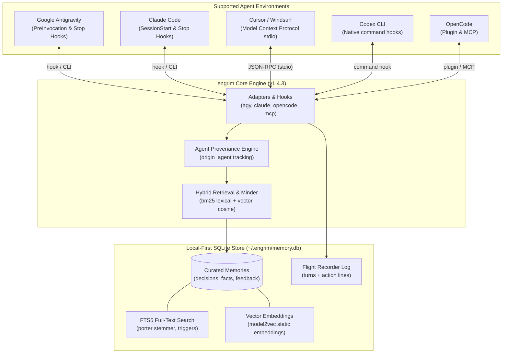

# engrim

[](https://github.com/timgordontg/engrim/actions/workflows/ci.yml)
[](https://pypi.org/project/engrim/)
[](https://www.python.org/)
[](LICENSE)
[](#security--privacy)
[](https://glama.ai/mcp/servers/timgordontg/engrim)

**The Universal Cross-Model & Cross-Agent Episodic Memory Store.**

A local-first, project-scoped SQLite memory engine that allows developers to freely switch between models and environments (**Google Antigravity**, **Claude Code**, **Cursor MCP**, **Windsurf**, **OpenCode**) on the **SAME** project without losing architectural decisions, user constraints, or project state.

---

## 1. The Core Value Proposition

> **"Why pay for 200,000 tokens of forgotten noise on every turn? The models are disposable utilities; your project's decisions are not."**

As context windows scale to 1M+ tokens, developers face **attention dilution**: reasoning degrades, cost multiplies with every conversational turn, and clearing context causes total amnesia.

`engrim` replaces attention dilution with **4,000 characters of curated episodic working memory**:
- **Switzerland of AI Memory**: Decouples project intelligence from any single AI vendor or proprietary cloud silo. Switch from Gemini 3.8 in Antigravity to Claude 3.7 Sonnet in Claude Code to Codex CLI mid-project — your agents pick up right where the others left off.
- **Save Button for Autonomous Coding**: Externalize decisions, constraints, and state as you work. The connected AI agents (Antigravity, Claude Code, Cursor, Codex CLI, OpenCode) can automatically write to memory via MCP tools when they make architectural decisions, or you can manually save them (`engrim add`). Clear your agent session freely (`/clear`) and watch context reload intact.
- **Smart, Hot Context Loading**: Combines SQLite FTS5 (bm25 keyword search) with static vector embeddings (`model2vec`) in a zero-latency hybrid reciprocal-rank fusion engine.

---

## 2. Empirical Proof (The 105-Session Case Study)

> **Tested across 105 continuous sessions on a 50,000-line algorithmic trading system. Zero regressions across 186 unit tests, zero context amnesia across model switches.**

In production testing on an active algorithmic trading codebase running real capital:
- Over **153,000 tokens of work** across days of architecture, parameter tuning, and debugging was consolidated into an active memory pack under **1,000 tokens** (<1% of the context window).
- That is a **99%+ cut in reloaded context cost** on every session restart.
- Seamlessly switched between Google Antigravity CLI, Claude Code, and Cursor MCP on identical repos with zero model drift or architectural regression.

---

## 3. Architecture


```mermaid
graph TD
    subgraph Agents ["Supported Agent Environments"]
        AGY["Google Antigravity<br/>(PreInvocation & Stop Hooks)"]
        CLAUDE["Claude Code<br/>(SessionStart & Stop Hooks)"]
        CURSOR["Cursor / Windsurf<br/>(Model Context Protocol stdio)"]
        CODEX["Codex CLI<br/>(Native command hooks)"]
        OPENCODE["OpenCode<br/>(Plugin & MCP)"]
    end

    subgraph CoreEngine ["engrim Core Engine (v1.4.3)"]
        ADAPTERS["Adapters & Hooks<br/>(agy, claude, opencode, mcp)"]
        PROVENANCE["Agent Provenance Engine<br/>(origin_agent tracking)"]
        ROUTER["Hybrid Retrieval & Minder<br/>(bm25 lexical + vector cosine)"]
    end

    subgraph Storage ["Local-First SQLite Store (~/.engrim/memory.db)"]
        MEMORIES[("Curated Memories<br/>(decisions, facts, feedback)")]
        FTS5["FTS5 Full-Text Search<br/>(porter stemmer, triggers)"]
        VEC["Vector Embeddings<br/>(model2vec static embeddings)"]
        LOG["Flight Recorder Log<br/>(turns + action lines)"]
    end

    AGY <-->|"hook / CLI"| ADAPTERS
    CLAUDE <-->|"hook / CLI"| ADAPTERS
    CURSOR <-->|"JSON-RPC (stdio)"| ADAPTERS
    CODEX <-->|"command hook"| ADAPTERS
    OPENCODE <-->|"plugin / MCP"| ADAPTERS
    ADAPTERS --> PROVENANCE
    PROVENANCE --> ROUTER
    ROUTER --> MEMORIES
    MEMORIES --- FTS5
    MEMORIES --- VEC
    ADAPTERS --> LOG
```

---

## 4. Multi-Agent Quickstart

### Installation

```bash
pip install engrim
```

### Auto-Detection (Recommended)

Run `engrim setup` without arguments. It automatically detects installed environments on your machine and configures them all:

```bash
engrim setup
```

- If `~/.gemini` exists $\rightarrow$ wires Antigravity lifecycle hooks, skill, and MCP server.
- If `~/.claude` exists $\rightarrow$ wires Claude Code SessionStart, Stop, status line, and CLAUDE.md.
- If `~/.cursor` exists $\rightarrow$ generates and merges Cursor MCP configuration.
- If `~/.codex` exists $\rightarrow$ wires Codex CLI native command hooks.
- If `~/.config/opencode` exists $\rightarrow$ writes the OpenCode plugin, registers the MCP server, and adds `AGENTS.md` notes.

### Explicit Platform Setup

#### Google Antigravity
```bash
engrim setup --agy
```
- Configures `~/.gemini/config/hooks.json` to execute `engrim hook --agent agy --event boot` on `PreInvocation` and `engrim hook --agent agy --event stop` on `Stop`.
- Deploys the canonical Antigravity skill to `~/.gemini/config/skills/engrim/SKILL.md`.
- Registers the MCP server in `~/.gemini/antigravity-cli/mcp_config.json` and `~/.gemini/config/mcp_config.json`.

#### Claude Code
```bash
engrim setup --claude
```
- Wires `SessionStart`, `SessionEnd`, `Stop`, and `UserPromptSubmit` hooks in `~/.claude/settings.json`.
- Configures live ambient status line in Claude Code's status bar.
- Appends memory usage notes to `~/.claude/CLAUDE.md`.

#### Cursor
```bash
engrim setup --cursor
```
- Adds `engrim` to `~/.cursor/mcp.json` running `engrim serve --mcp`.


#### Codex CLI
```bash
engrim setup --codex
```
- Wires `SessionStart`, `SessionEnd`, `Stop`, and `UserPromptSubmit` command hooks in `~/.codex/hooks.json`.
- Calls the local `engrim` CLI directly, so MCP is not required. The hooks must be reviewed and trusted
  with Codex's `/hooks` command before they run.
- `engrim statusline` accepts Codex-shaped session payloads, but Codex's built-in footer only supports
  its own status item identifiers, not arbitrary status commands.

#### OpenCode
```bash
engrim setup --opencode
```
OpenCode has no shell hooks, so engrim ships as a plugin plus an MCP server:
- Writes `~/.config/opencode/plugins/engrim.js` (respects `$XDG_CONFIG_HOME`). The plugin calls `engrim hook --agent opencode` at each lifecycle moment:
  - **session boot** → the memory pack is injected into the system prompt (once per session, and again after compaction);
  - **every prompt** → the minder pulls the few records relevant to that message;
  - **session idle** → the session's new user/assistant turns land in the flight-recorder log (idempotent, keyed on OpenCode's message ids);
  - **compaction** → the compaction prompt is told that durable memory lives in engrim and to list any uncaptured decisions so they get `engrim_add`-ed.
- Registers `mcp.engrim` (`engrim serve --mcp`) in `~/.config/opencode/opencode.json`, exposing the `engrim_*` tools to the agent. Existing keys are preserved; a commented `opencode.jsonc` is never rewritten.
- Appends a short usage note to `~/.config/opencode/AGENTS.md`.

Cost note: the boot pack (≤4,000 chars by default) and the usage note ride in the system prompt of every model call in the session, including title and subagent calls — that is how OpenCode's `system.transform` works. Set `ENGRIM_BOOT_BUDGET` (chars, default 4000) in OpenCode's environment to shrink the pack, or curate harder, if that overhead matters to you.

This makes engrim the durable memory layer for OpenCode: its own SQLite session store and compaction summaries stay as the transcript, while decisions, constraints, and state live in `~/.engrim/memory.db` where every other agent on the repo can read them. Restart OpenCode after setup; `engrim uninstall --opencode` reverses all three steps.

##### "OpenCode already has a SQLite database — why add engrim?"

It does, and it is good at what it is for. `opencode.db` holds sessions, messages, and parts: it is the **transcript** store for one tool. It has no memory table, no cross-session retrieval the model can call, and nothing outside OpenCode can read it. engrim solves a different problem, and the plugin makes the two complementary rather than competing:

- **Switch harnesses on the same task.** Start in OpenCode, finish in Claude Code, Codex CLI, Cursor, or Antigravity (or the other way round). Every one of them boots from the same `~/.engrim/memory.db`, so the decisions you made in one show up in the next. OpenCode's session store is invisible to the others by design.
- **Curated memory, not replayed history.** OpenCode's answer to "what did we decide?" is a compaction summary: lossy, regenerated each time, and gone with the session. engrim stores typed records (`decision`, `fact`, `state`, `feedback`, `user`, `reference`) that can be superseded, tagged, and retired, and injects a priority-ordered pack of at most a few thousand characters instead of re-reading a transcript.
- **Survives `/new`, compaction, and deleted sessions.** A fresh OpenCode session starts from `AGENTS.md` alone. With engrim the boot pack is injected again on every session and after every compaction, and the resume pointer says exactly where to pick up.
- **Retrieval the model can drive.** Hybrid FTS5 + vector recall (`engrim_recall`), a per-prompt minder that surfaces the few records relevant to the message being answered, and explicit write access (`engrim_add`) so the agent can save a decision the moment it makes one.
- **Provenance across tools.** Every record carries `origin_agent`, so you can see that a constraint came from a Codex session and a reversal came from OpenCode.
- **A capture safety net.** `engrim review` and the compaction hook flag decisions that are still only in the transcript before they get summarised away; the session-idle hook keeps a flight-recorder log of turns so a hard window-close can't lose them.
- **Portable and yours.** One SQLite file you can `engrim backup`, `engrim merge` into another store, share between host and container with `ENGRIM_PROJECT`, and inspect or edit with plain SQL. No vendor format, no cloud.

If you only ever use OpenCode and never clear a session, `opencode.db` is enough. The moment a task spans two sessions or two tools, it isn't.

#### Windsurf
Add `engrim` to your `~/.codeium/windsurf/mcp_config.json`:
```json
{
  "mcpServers": {
    "engrim": {
      "command": "engrim",
      "args": ["serve", "--mcp"]
    }
  }
}
```

#### All Platforms
```bash
engrim setup --all
```
- Configures every supported environment in one command.

*(Use `--dry-run` with any setup command to inspect changes without modifying disk).*

#### GitHub Actions (gh-aw)
See [`examples/gh-aw/`](examples/gh-aw/) for engrim inside [GitHub Agentic Workflows](https://github.github.com/gh-aw/): memory across runs through artifacts and `engrim merge`, and a continue-as-clear restart instead of auto-compaction.

---

## 5. Agent Provenance Tracking

When multiple agents collaborate on a single codebase, provenance matters. `engrim` records the origin of every memory entry with the `origin_agent` field:
- Allowed values: `antigravity`, `claude-code`, `cursor`, `opencode`, `cli`, or `user`.
- Automatically populated based on the active hook, MCP client, or CLI session.
- Subtly surfaced in `engrim context` and `engrim list`:

```text
🧠 engrim · memory restored for this project — you don't have to re-explain · /workspace
  18 of 54 curated records loaded (~3850 chars) · the rest one `recall` away

[DECISION]
- #961 [DECISION] (via Antigravity): Inverted stop loss matrix for high volatility  (risk, execution)
- #942 [DECISION] (via Claude Code): Switched primary database from MongoDB to PostgreSQL  (db, schema)
- #910 [DECISION] (via Cursor): Standardized on Pydantic v2 schemas across API boundaries  (api, types)
```

Existing databases are non-destructively migrated on first access via `ALTER TABLE memories ADD COLUMN origin_agent TEXT`.

---

## 6. Hardened Model Context Protocol (MCP) Server

Launch the zero-dependency, JSON-RPC 2.0 stdio MCP server:

```bash
engrim serve --mcp
# or: engrim mcp
```

`stdout` is strictly reserved for JSON-RPC messages, redirecting all diagnostic logs to `stderr`.

### Core MCP Tools Exposed:

| Tool | Signature | Purpose |
|---|---|---|
| `engrim_recall` | `(query: str, project: str = "auto", k: int = 5, type: str = None, tag: str = None)` | Search project memory using hybrid ranking (optionally filter by type or tag). |
| `engrim_add` | `(type: str, summary: str, detail: str = None, tags: list[str] = [])` | Write a durable memory record persisted across sessions. |
| `engrim_context` | `(project: str = "auto", budget: int = 4000)` | Retrieve the session-boot memory pack within a character budget. |
| `engrim_review` | `(project: str = "auto")` | Check uncaptured decisions from transcript logs before clearing. |

`engrim_review` returns `safe_to_clear: null` (unknown) when the project has no transcript log,
even if it has saved memories. With logged turns, the field is a boolean heuristic verdict:
`false` means possible uncaptured decisions were detected; `true` means none were detected in
the reviewed log. It does not verify that logging captured the entire session.

---

## 7. CLI Reference

| Command | Usage | Description |
|---|---|---|
| `engrim add` | `engrim add -t decision -s "..." [--origin-agent agy]` | Insert memory record (types: `decision`, `fact`, `feedback`, `state`, `user`, `reference`). |
| `engrim recall` | `engrim recall -q "database" [--tag auth]` | Ranked hybrid recall for the project (`--tag` filters by tag; `--log` searches raw turns). |
| `engrim context` | `engrim context [-b 4000]` | Priority-ordered, budget-capped session-boot pack. |
| `engrim hook` | `engrim hook --agent agy --event boot` | Agent lifecycle hook runner for Claude Code, Antigravity, and OpenCode (`--agent opencode --event boot\|prompt\|stop`, JSON on stdin). |
| `engrim setup` | `engrim setup [--agy\|--claude\|--cursor\|--codex\|--opencode\|--all] [--strict]` | Universal multi-agent environment configuration (`--strict` wires gate mode). |
| `engrim serve` | `engrim serve --mcp` | Start stdio MCP server for agent integrations. |
| `engrim review` | `engrim review [--strict]` | "Safe to clear" coverage check: scans logs for uncurated decisions (`--strict` exits 2 if uncaptured). |
| `engrim prune` | `engrim prune [--keep-days <N> \| --all \| --vacuum]` | Purge old transcript logs and VACUUM the SQLite DB (opt-in retention; off by default). |
| `engrim list` | `engrim list [-k 20] [--tag auth]` | List recent memories for the current project (supports `--tag`). |
| `engrim project` | `engrim project [-p PROJECT \| --global \| --all] [--json]` | Records, active count and last write for one project tag (the current one by default), or every tag with `--all`. |
| `engrim projects` | `engrim projects [--json]` | Every project's counts — the same as `engrim project --all`. |
| `engrim supersede`| `engrim supersede --id 12 --status superseded` | Mark a record superseded without erasing history. |
| `engrim retire` | `engrim retire [--all] [--dry-run] [--json]` | Mark the active `resume-pointer` record(s) done once their work is finished (never erases). |
| `engrim sync` | `engrim sync [DIR]` | Mirror markdown memories into the store (idempotent seed-once). |
| `engrim merge` | `engrim merge OTHER.db [--dry-run]` | Fold another store's records into this one (content-keyed, idempotent; retirements carry over). |
| `engrim backup` | `engrim backup COPY.db [--force] [--json]` | Consistent copy of the whole store via SQLite's online backup API (safe while agents hold it open). |

---

## 8. Continue-As-Clear Workflow

1. **Capture as you work**: Whenever a major decision or architectural rule is made, it needs to be saved to memory. The AI agent will often do this automatically via the `engrim_add` tool, but you can also manually intervene by running `engrim add` yourself.
2. **Use `resume-pointer`**: Before ending a session or clearing, add a record tagged `resume-pointer` describing the immediate next task. The newest pointer is pinned under `[▶ RESUME HERE]` at the top of the next session's boot pack. When that work is done, `engrim retire` marks the pointer(s) `done` so a finished task never leads a later pack.
3. **Verify with `engrim review`**: Check that all recent decisions are captured.
4. **Clear freely (`/clear`)**: The session window is wiped clean; `engrim` automatically re-injects the active memory pack on the next prompt or invocation.

---

## 9. How Does Engrim Compare?

There are several other memory solutions and coding assistants out there (such as gbrain, OpenCode, Codex, and Pi). Here is how `engrim` differs:

- **vs gbrain**: While gbrain is a great provider-agnostic memory tool, `engrim` sets itself apart by using a lightweight, local-first SQLite architecture. This keeps everything fast and offline without needing complex setup or cloud dependencies.
- **vs OpenCode & Codex**: Their built-in SQLite stores hold *transcripts* (sessions, messages, compaction summaries) for one tool. `engrim` is an *episodic* memory engine that tracks the *provenance* of decisions across multiple different agents (Antigravity, Claude Code, Cursor, Codex CLI, OpenCode) and operates as a unified backend that all your tools share — with the OpenCode plugin, engrim becomes OpenCode's durable memory layer rather than competing with it. See [the OpenCode setup notes](#opencode) for the point-by-point case.
- **vs Pi**: Pi acts as a personal AI companion with a long-term memory. `engrim` is specifically tailored for **coding projects** and software architecture—capturing decisions, state, and constraints in a format that coding agents can efficiently query via hybrid search (FTS5 + vector).

---

<a id="security--privacy"></a>
## 10. Security & Privacy

- **100% Local & Offline**: All memory records and logs reside in a local SQLite file (`~/.engrim/memory.db`). No telemetry, no cloud sync, no tracking.
- **Model Storage**: Uses `model2vec` for local static embeddings (~30ms load time, no GPU required, runs on CPU). Can run pure-lexical (`ENGRIM_EMBED=off`) for zero extra dependencies.
- **POSIX File Permissions**: Databases are created with restricted owner-only permissions (`0600`).
- **Git Protection**: `*.db` is gitignored by default; your memories never accidentally commit to version control.

---

## 11. Author & Contact

Created by **Tim Gordon** ([@timgordontg](https://github.com/timgordontg)).
- **LinkedIn:** [linkedin.com/in/timgordon1](https://www.linkedin.com/in/timgordon1)
- **Email:** [timgordontg@gmail.com](mailto:timgordontg@gmail.com)

Founder & Creator @ Engrim. Raising a $2.0M Seed round for In-VPC Autonomous CI infrastructure. Enterprise inquiries & collaborations: timgordontg@gmail.com

---

## 12. License

MIT © 2026 Tim Gordon.
